# Hola, soy Christian Albornoz ✨

---

## 👋 Sobre mí

Soy **Contador Auditor transformado en Ingeniero de Software**.
Combino **+11 años de experiencia financiera** con arquitectura de software moderna para crear herramientas que entienden el negocio.
Diseño sistemas que resuelven problemas contables reales, priorizando la solidez del dato y la experiencia del usuario.

---

## 🚀 Ecosistema Contable (Nostromo)

Actualmente, construyo **Nostromo**, un **Sistema Contable de última generación** diseñado con arquitectura de micro-agentes y separación estricta de responsabilidades.

| Proyecto | Rol | Tech Stack | Link
| :--- | :--- | :--- | :---
| **Nostromo** | 🧠 **Core & Commander**   Gestión de Datos, ETLs y Supervisión. | `Python` `PostgreSQL` `Data Engineering` | [Ver Detalle](projects/nostromo.md)
| **Orchestrator** | ⚙️ **Backend & Truth**   Lógica de negocio, API y Seguridad. | `Node.js` `Express` `TypeScript` | [Ver Detalle](projects/orchestrator.md)
| **Sevastopol** | 🎨 **Frontend & UX**   Arquitectura de Islas y Diseño Atómico. | `Astro` `SolidJS` `Tailwind` | [Ver Detalle](projects/sevastopol.md)
| **Jean d'Arc** | 📚 **Documentation**   Fuente de verdad y guías técnicas. | `Astro Starlight` `Mermaid` | [Ver Detalle](projects/jean-d-arc.md)

---

## 🛠️ Tech Stack

---

## 📊 System Status

---

## 📬 Contacto

- 📧 [chris@albornoz.studio](mailto:chris@albornoz.studio)
- 📍 Santiago, Chile 🇨🇱
