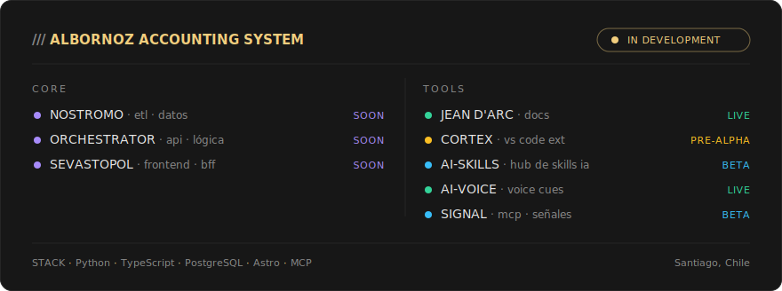

# Christian Albornoz

Contador Auditor reconvertido en ingeniero de software. Trabajo en productos donde la arquitectura y el dominio contable tienen que convivir sin fricción: datos confiables, reglas de negocio explícitas y una interfaz que no esconda complejidad detrás de improvisación.

Este repositorio funciona como vitrina pública de mi trabajo. Los repositorios operativos del ecosistema son privados, así que aquí concentro una versión publicable de su contexto, sus decisiones arquitectónicas y el rol que cumple cada pieza.

## Ecosistema

| Proyecto | Rol | Stack principal | Documento público |
| :--- | :--- | :--- | :--- |
| **Nostromo** | Core de datos, ETL y automatización | `Python` `PostgreSQL` `Data Engineering` | [projects/nostromo.md](projects/nostromo.md) |
| **Orchestrator** | Backend de negocio, API y seguridad | `Node.js` `Express` `TypeScript` | [projects/orchestrator.md](projects/orchestrator.md) |
| **Sevastopol** | Frontend, BFF y experiencia de usuario | `Astro` `SolidJS` `Tailwind` | [projects/sevastopol.md](projects/sevastopol.md) |
| **Jean d'Arc** | Documentación, arquitectura y guías operativas | `Astro Starlight` `Mermaid` | [projects/jean-d-arc.md](projects/jean-d-arc.md) |

## Herramientas y extensiones

Tooling propio creado para sostener el ecosistema. Repositorios operativos privados, documentos públicos sanitizados.

| Herramienta | Tipo | Stack principal | Documento público |
| :--- | :--- | :--- | :--- |
| **Cortex** | Extensión VS Code | `TypeScript` `MongoDB` `React Flow` | [github.com/ChrisTkm/nostromo_cortex](https://github.com/ChrisTkm/nostromo_cortex) |

## Qué encontrarás aquí

- Un resumen público por proyecto con su propósito, límites y arquitectura.
- Explicaciones suficientes para entender cómo se integran entre sí.
- Información sanitizada: sin credenciales, sin esquemas sensibles, sin endpoints internos ni detalles de despliegue reservados.

## Qué problemas ataca este ecosistema

- Reducir trabajo manual en cargas contables, documentos tributarios y procesos repetitivos.
- Concentrar reglas de negocio, permisos y contexto multi-tenant en una capa verificable.
- Entregar una interfaz operable para tareas complejas sin exponer complejidad interna al navegador.
- Mantener documentación útil para onboarding, operación y evolución técnica aunque los repositorios no sean públicos.

## Principios de trabajo

- El dato contable no se improvisa: la trazabilidad y la validación son parte del diseño.
- El frontend no absorbe lógica de negocio que pertenece al backend.
- La documentación no es un accesorio; es parte del sistema.
- La automatización tiene que reducir errores operativos, no solo ahorrar clicks.

## Stack

## Estado del sistema

## Contacto

- Email: [chris@albornoz.studio](mailto:chris@albornoz.studio)
- Ubicación: Santiago, Chile
