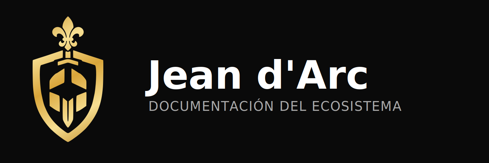

# Jean d'Arc

Plataforma de documentación, arquitectura y transferencia de conocimiento del ecosistema contable.

**Sitio público:** [https://docs.albornoz.studio/](https://docs.albornoz.studio/)

> [!NOTE]
> Este resumen es público. Describe el propósito y la estructura documental del proyecto sin publicar material interno sensible ni documentación reservada para operación.

[](https://docs.albornoz.studio/)
[](https://astro.build)
[](https://starlight.astro.build/)
[](https://mermaid.js.org/)

## Qué resuelve


Jean d'Arc existe para evitar que el conocimiento técnico termine repartido entre chats, memoria informal, comentarios incompletos o decisiones difíciles de reconstruir después.

Su propósito es concentrar la documentación necesaria para que arquitectura, desarrollo, operación y onboarding compartan una misma referencia.

## Dos zonas

El sitio se organiza en dos lados paralelos:

- **Lado Contable** — manual de cuentas chileno, IFRS, remuneraciones, operaciones SII, declaraciones, ciclo contable, balances, renta. Para contadores auditores, control interno y usuarios de validación financiera.
- **Lado Desarrollador** — arquitectura, services del backend, API, frontend con islands reactivas, ETL Python, base de datos multi-tenant, seguridad. Para personas que construyen, mantienen o integran con el ecosistema.

Cada página declara su audiencia (`auditor`, `dev` o `both`) en su frontmatter y enlaza con su contraparte cross-zone cuando aplica.

## Audiencias

La documentación está pensada para varios tipos de lector:

- **Contador auditor** que necesita criterios de reconocimiento, manual de cuentas, IFRS y trazabilidad de procesos contables;
- **Persona desarrolladora** que requiere contexto técnico, contratos de API y patrones de integración;
- **Usuarios internos** que consultan guías operativas;
- **Futuros mantenedores** que deben entender decisiones previas;
- **Trabajo asistido** por agentes o automatizaciones documentales.

## Tipos de contenido

- visión general del ecosistema;
- decisiones de arquitectura;
- contratos y convenciones de integración;
- criterios contables, tratamiento IFRS y guía tributaria;
- documentación de módulos y dominios;
- onboarding y material de referencia.

## Estructura documental

```text
accounting/   Lado Contable: dominio contable, IFRS, remuneraciones, manual de cuentas
dev/          Lado Desarrollador: arquitectura, backend, frontend, ETL, seguridad
```

Cada zona se subdivide en dominios específicos. La estructura exacta puede cambiar con el tiempo, pero la dualidad Contable / Desarrollador se mantiene como columna principal.

## Decisiones de plataforma

- `Astro` como base ligera para publicar contenido técnico.
- `Starlight` para ordenar navegación, búsqueda y lectura.
- `Mermaid` para diagramas como código y mantenimiento simple.
- Markdown como formato principal para facilitar revisión y edición.

## Flujos que habilita

### Onboarding técnico

1. Una persona nueva necesita entender el sistema.
2. Jean d'Arc explica la arquitectura general y las piezas del ecosistema.
3. La persona puede profundizar por dominio sin depender de transmisión oral.

### Mantenimiento y evolución

1. Un cambio técnico requiere contexto.
2. La documentación concentra decisiones previas y límites relevantes.
3. El equipo reduce retrabajo y contradicciones entre repositorios.

Ejemplo público representativo: cuando una integración cambia o aparece una regla operativa nueva, Jean d'Arc permite registrar el criterio, el alcance y las dependencias afectadas sin dejar esa información atrapada en mensajes o reuniones.

## Qué no se publica aquí

Por diseño, esta vitrina pública omite:

- procedimientos internos con acceso restringido;
- configuraciones de infraestructura;
- información de clientes o datos operativos;
- manuales que dependan de entornos cerrados;
- decisiones sensibles de seguridad con detalle explotable.

## Relación con el ecosistema

- documenta a `Nostromo`, `Orchestrator`, `Sevastopol` y `Mother`;
- ayuda a mantener alineadas arquitectura y operación;
- reduce dependencia de conocimiento tribal.

## Estado público del proyecto

Jean d'Arc convierte documentación en parte explícita del sistema. No es un anexo; es la forma de mantener coherencia técnica cuando el producto crece y los repositorios no pueden ser públicos.
