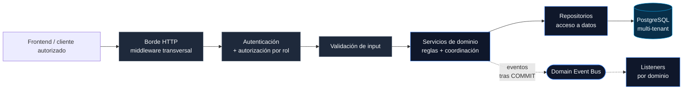

# Orchestrator

Backend de negocio, API y seguridad del ecosistema contable.

> [!NOTE]
> Este documento es público y sanitizado. Describe el enfoque arquitectónico y las responsabilidades del backend sin exponer endpoints internos sensibles, credenciales ni detalles operativos reservados.

[](https://nodejs.org/)
[](https://www.typescriptlang.org/)
[](https://expressjs.com/)
[](https://www.postgresql.org/)
[](https://jestjs.io/)

## Qué resuelve

Orchestrator concentra la lógica de negocio que no debe quedar dispersa entre pantallas, scripts o decisiones ad hoc. Es la capa que valida, autoriza, compone reglas y protege la consistencia transaccional del sistema.

Su rol es sencillo de definir y difícil de reemplazar: actuar como fuente de verdad operacional.

## En números

| Métrica | Valor |
|---|---|
| Dominios de negocio | **33** |
| Archivos de prueba | **111** (unit + integración) |
| Líneas de código en `src/` | **~79.500** |
| · de las cuales dominio | **~44.000** |
| · de las cuales pruebas | **~19.200** |
| Bases de datos coordinadas | **3** (central · común · template por tenant) |

> Los números reflejan tamaño real del proyecto, no completitud funcional. La arquitectura sostiene crecimiento sin reescritura.

## Responsabilidades

- Exponer API para el frontend y otros consumidores controlados.
- Validar entradas antes de que toquen la lógica de negocio.
- Resolver contexto de tenant y permisos de usuario.
- Encapsular reglas de negocio y cálculos críticos.
- Coordinar persistencia, lectura y escritura hacia PostgreSQL.
- Proveer una base comprobable mediante pruebas y convenciones claras.

## Modelo arquitectónico

El backend sigue una estrategia híbrida:

- la lógica y las escrituras viven en servicios TypeScript;
- las lecturas pesadas y reportes pueden apoyarse en SQL y vistas optimizadas;
- la seguridad y el contexto de acceso atraviesan el request desde el borde.



Los eventos de dominio se emiten **después del commit** transaccional, no durante: si la transacción falla, no hay efectos fantasma río abajo.

## Capas principales

- **borde HTTP** para recibir requests y aplicar middleware transversal;
- **autenticación y autorización** para identidad, roles y contexto de acceso;
- **servicios de dominio** donde viven reglas, validaciones y coordinación;
- **persistencia y lectura optimizada** detrás de una capa explícita;
- **bus de eventos de dominio** para reaccionar a cambios sin acoplar servicios.

## Forma de un servicio de dominio

> Snippet representativo, no extraído del código real. Ilustra el patrón compartido entre servicios.

```typescript
class ExampleService extends BaseService {
  async create(ctx: ServiceContext, input: ExampleInput): Promise<Example> {
    this.validateInput(input);

    return this.withTransaction(ctx, async (tx, outbox) => {
      const created = await this.repo.insert(tx, input);

      outbox.queue("example.created", {
        tenantId: ctx.tenantDb,
        entityId: created.id,
      });

      return created;
    });
  }
}
```

Tres invariantes que sostiene este patrón:

1. La validación corre **antes** de tocar la base.
2. La escritura es **transaccional** end-to-end.
3. Los eventos se emiten **después del commit**, no en medio.

## Dominios cubiertos

El backend está organizado en módulos por área de negocio. Cada dominio tiene su servicio, su repositorio, sus tipos y sus pruebas, sin filtrar lógica a otras capas.

| Área | Dominios |
|---|---|
| **Contable nuclear** | Plan de cuentas · Ciclo contable · Configuración contable · Reportes |
| **Operaciones** | Operaciones · Gastos · Financieros · Inventario · Activos fijos |
| **Tributario** | Declaraciones mensuales · Declaraciones juradas |
| **Laboral / RRHH** | Remuneraciones · Empleados · Contratos · Asistencia · Vacaciones · Isapre · Previsionales · Finiquitos · Jornadas · Honorarios · Cargos |
| **Sistema y acceso** | Autenticación · Permisos · Empresas · Capital · Representantes legales · Configuración de sistema · Caché |

## Seguridad

La seguridad no es una capa decorativa. Forma parte del flujo normal del backend:

- autenticación basada en sesión o token;
- autorización con roles y rutas protegidas;
- validación y sanitización de inputs;
- hardening HTTP;
- separación de contexto por tenant.

## Principios de implementación

- El frontend no decide reglas contables.
- Los cálculos críticos no se duplican en múltiples capas.
- Los errores deben ser trazables y operar con contratos consistentes.
- La estructura del código debe favorecer mantenimiento antes que velocidad aparente.

## Testing y confiabilidad

Orchestrator está pensado para sostener pruebas en más de un nivel:

- **unitarias** para servicios y utilidades;
- **integración** para rutas y persistencia contra PostgreSQL real;
- **end-to-end** para flujos críticos expuestos al usuario.

Los 111 archivos de prueba se distribuyen entre los 33 dominios, no concentrados en una sola capa. El criterio es claro: la capa central del negocio debe ser verificable.

## Stack técnico

| Capa | Elección |
|---|---|
| Runtime | Node.js 20+ |
| Lenguaje | TypeScript |
| HTTP | Express 5 |
| Persistencia | PostgreSQL · `pg` |
| Validación | `express-validator` |
| Pruebas | Jest |
| Observabilidad | Logger estructurado + endpoint Prometheus |

## Límites públicos

Esta página omite deliberadamente:

- nombres reales de tenants o clientes;
- contratos internos completos de API;
- configuración de secretos, sesiones o despliegue;
- detalles finos de rate limiting, observabilidad o infraestructura.

## Relación con otros proyectos

- `Sevastopol` consume esta capa a través de un BFF y rutas controladas.
- `Nostromo` complementa el backend con procesos batch y trabajo de datos.
- `Jean d'Arc` concentra la documentación y las convenciones que sostienen el sistema.

## Estado público del proyecto

Orchestrator representa la disciplina del sistema: una capa intermedia que permite crecer sin volver caótico el dominio contable ni filtrar lógica sensible hacia la interfaz.
