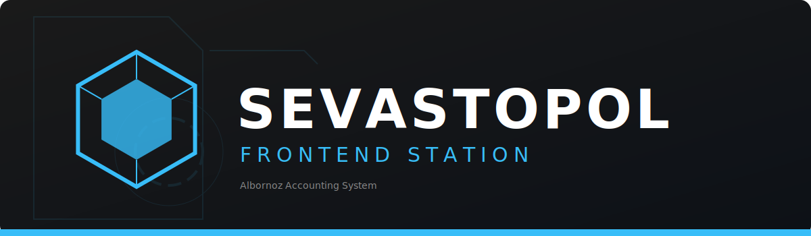

# 🛰️ Sevastopol Frontend

**"La Fortaleza Visual" del Ecosistema Contable.**

> [!NOTE]
> Este proyecto es **Privado**. Esta página es una vitrina de su arquitectura y propósito.

[](https://astro.build)
[](https://www.solidjs.com/)
[](https://tailwindcss.com/)

---

**Sevastopol** es la interfaz visual del Ecosistema Contable, construida sobre una arquitectura de **Islas (Islands Architecture)** para maximizar el rendimiento y desacoplar la lógica de negocio.

Actúa como la "terminal de acceso" segura hacia el núcleo **Albornoz Accounting System**.

## 🤖 Agente Sevastopol

> *"Integridad Visual y Control de Arquitectura"*

Este repositorio es vigilado por el **Agente Sevastopol**, encargado de asegurar que la interfaz sea robusta, eficiente y visualmente consistente.

**Responsabilidades:**

- **Revisor Arquitectónico**: Verifica que no haya fugas de lógica de negocio en el frontend.
- **Inspector Visual**: Asegura el cumplimiento del **Atomic Design**.
- **Guardián del Rendimiento**: Controla la hidratación y carga de las islas.

---

## 🏗️ Arquitectura y Patrones

### Backend-for-Frontend (BFF)

Sevastopol implementa un patrón de proxy estricto para comunicarse con el backend:

1. **Frontend (Solid Island)**: Llama a `/api/tenant` (local).
2. **Sevastopol (Astro API)**: Intercepta y reenvía a `Orchestrator` (`localhost:8000`).
3. **Seguridad**: La cookie `sid` viaja automáticamente. **NUNCA** hay conexión directa a PostgreSQL.

### Atomic Design

La estructura de componentes sigue una jerarquía estricta:

- **⚛️ Atoms**: Componentes puros (`Button`, `Input`). Sin lógica.
- **🧬 Molecules**: Combinaciones con propósito visual (`StatCard`, `StatusBadge`).
- **🏝️ Islands**: Lógica de estado y datos (`TenantsViewIsland`). Solo aquí reside la interactividad.

## 🛠️ Stack Tecnológico

| Capa | Tecnología | Uso |
|------|------------|-----|
| **Core** | [Astro 5.x](https://astro.build/) | Server-Side Rendering (SSR) y Routing |
| **Interactividad** | [SolidJS](https://www.solidjs.com/) | Componentes reactivos ligeros (Islands) |
| **Estilos** | [Tailwind CSS](https://tailwindcss.com/) | Sistema de diseño utilitario |
| **Testing** | [Playwright](https://playwright.dev/) | Pruebas End-to-End (E2E) |

## 📂 Mapa de la Estación

```text
src/
├── components/         # Atomic Design System
│   ├── atoms/          # Botones, Inputs, Iconos
│   ├── molecules/      # Cards, Headers, Formularios
│   └── organisms/      # Secciones completas no interactivas
├── islands/            # 🏝️ Componentes Interactivos (SolidJS)
│   ├── auth/           # Login, Recuperación
│   └── dashboard/      # Vistas principales
├── pages/              # Rutas de la aplicación (Astro)
│   ├── api/            # API Endpoints (BFF)
│   └── [tenant]/       # Rutas dinámicas por cliente
└── layouts/            # Plantillas maestras
```

---

<div align="center">
  <sub>Parte del ecosistema <b>Albornoz Accounting System</b>.</sub>
</div>
