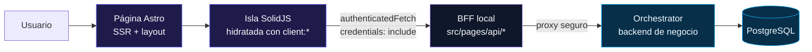

# Sevastopol

Frontend, BFF y capa de experiencia del ecosistema contable.

> [!NOTE]
> Esta es una descripción pública del proyecto. Resume arquitectura, principios y responsabilidades sin exponer código privado, credenciales ni detalles internos del producto.

[](https://astro.build)
[](https://www.solidjs.com/)
[](https://tailwindcss.com/)
[](https://www.typescriptlang.org/)
[](https://playwright.dev/)

## Qué resuelve

Sevastopol es la cara visible del sistema. Toma una plataforma compleja y la convierte en una experiencia operable para personas que necesitan ejecutar tareas contables sin pelear con la arquitectura.

No intenta absorber lógica de negocio. Su trabajo es presentar, guiar, validar en superficie y delegar correctamente al backend.

## En números

| Métrica | Valor |
|---|---|
| Islas interactivas (SolidJS) | **62** |
| Componentes del sistema de diseño | **34** (17 atoms · 15 molecules · 2 organisms) |
| Áreas funcionales cubiertas | **18** |
| Endpoints BFF (proxy controlado) | **64** |
| Pruebas end-to-end | **18** (Playwright) |
| Líneas de código en `src/` | **~55.700** |

> La hidratación selectiva mantiene cada isla independiente: un cambio en remuneraciones no obliga a recargar nada del dominio contable.

## Principios del frontend

- La lógica crítica vive en el backend.
- La UI debe ser rápida incluso con dominios complejos.
- La interactividad se hidrata solo donde aporta valor real.
- La estructura visual tiene que ser mantenible, no ornamental.

## Arquitectura

El proyecto combina render del lado del servidor con islas interactivas:

- `Astro` ordena rutas, layouts y rendering base.
- `SolidJS` se usa en componentes interactivos o secciones con estado.
- La capa `api/` actúa como Backend-for-Frontend para proteger el acceso al backend real.


```mermaid
flowchart LR
    User["Usuario"] --> Page["Página Astro<br/>SSR + layout"]
    Page --> Island["Isla SolidJS<br/>hidratada con client:*"]
    Island -->|authenticatedFetch<br/>credentials: include| BFF["BFF local<br/>src/pages/api/*"]
    BFF -->|proxy seguro| Backend["Orchestrator<br/>backend de negocio"]
    Backend --> DB[("PostgreSQL")]

    classDef ui fill:#1e1b4b,color:#f8fafc,stroke:#6366f1
    classDef bff fill:#0f172a,color:#f8fafc,stroke:#a78bfa
    classDef back fill:#082f49,color:#f0f9ff,stroke:#0ea5e9
    class Page,Island ui
    class BFF bff
    class Backend,DB back
```

Ese patrón permite mantener cookies, contexto y validaciones sin exponer directamente la superficie interna del backend al navegador.

Ejemplo público representativo: una persona usuaria revisa un proceso contable con validaciones, filtros y estados intermedios. La interfaz resuelve interacción y feedback, pero delega permisos, reglas y persistencia al backend a través del BFF.

## Sistema de diseño

Sevastopol sigue una jerarquía compatible con Atomic Design. La separación no es estética solamente: sirve para evitar que la UI se convierta en un contenedor caótico de lógica dispersa.

| Capa | Cantidad | Rol |
|---|---:|---|
| `atoms` | 17 | piezas pequeñas, puras, sin estado de negocio |
| `molecules` | 15 | combinaciones reutilizables de atoms |
| `organisms` | 2 | bloques estructurales (sidebar, login) |
| `islands` | 62 | componentes que cargan estado e interactividad real |

Las islas son la unidad donde se permite estado, hooks y efectos. Todo lo demás se mantiene puro.

## Forma de una llamada autenticada

> Snippet representativo, no extraído del código real. Ilustra el patrón compartido entre islas.

```typescript
async function loadDomainData(filters: Filters): Promise<DomainItem[]> {
  const query = new URLSearchParams(filters as Record<string, string>);
  const res = await authenticatedFetch(`/api/domain/items?${query}`);

  if (res.status === 401) {
    return handleAuthResponse(res).then(() => []);
  }
  if (!res.ok) {
    throw new Error(`Failed to load: ${res.status}`);
  }
  return res.json();
}
```

Tres invariantes que sostiene este patrón:

1. La isla **nunca** consulta el backend directamente — siempre vía `/api/*` local.
2. Las cookies de sesión viajan automáticamente (`credentials: 'include'`).
3. El 401 se maneja de forma centralizada, no en cada isla.

## Áreas funcionales cubiertas

La interfaz acompaña al backend en sus dominios principales, agrupados por contexto operativo:

| Contexto | Áreas |
|---|---|
| **Contable nuclear** | Plan de cuentas · Ciclo contable · Manual de cuentas · Reportes |
| **Operaciones** | Operaciones contables · Ingresos · Gastos · Financieros · Activos fijos · Provisiones |
| **Tributario** | Declaraciones mensuales y juradas |
| **Laboral / RRHH** | Remuneraciones · Contratos · Asistencia · Finiquitos |
| **Administración** | Empresas · Usuarios · Configuración · Dashboard |

## Capas del proyecto

- sistema visual reutilizable para consistencia entre pantallas;
- islas interactivas para formularios, filtros y estados locales;
- rutas y endpoints del frontend para páginas y funciones BFF;
- layouts y composición para sostener navegación y estructura.

## Experiencia y rendimiento

Las decisiones del frontend apuntan a:

- reducir JavaScript innecesario;
- mantener tiempos de carga razonables;
- aislar la interactividad donde realmente hace falta;
- facilitar evolución visual sin romper contratos del dominio.

## Testing

El valor del frontend no está solo en verse bien. También debe sostener flujos reales:

- pruebas end-to-end (**Playwright**) para recorridos críticos: contratos, asistencia, declaraciones, finiquitos, empleados, manual de cuentas, plan de cuentas y flujos core;
- validación visual y funcional de componentes clave;
- control sobre regresiones en navegación, autenticación y formularios.

## Stack técnico

| Capa | Elección |
|---|---|
| Framework | Astro 5 (SSR) |
| Islas interactivas | SolidJS |
| Estilos | Tailwind CSS · modo claro/oscuro via `data-theme` |
| Lenguaje | TypeScript |
| Adapter | `@astrojs/node` standalone |
| E2E | Playwright |
| Comunicación | BFF proxy + cookies httpOnly |

## Qué se publica y qué no

Esta página deja fuera:

- pantallas de clientes o datos reales;
- capturas operativas con información sensible;
- endpoints internos detallados;
- configuración privada de despliegue.

## Relación con el ecosistema

- `Orchestrator` resuelve negocio, seguridad y persistencia.
- `Nostromo` sostiene procesos de datos y automatización fuera del request-response.
- `Jean d'Arc` documenta reglas, decisiones y convenciones para desarrollo y operación.

## Estado público del proyecto

Sevastopol representa la disciplina de poner una interfaz moderna delante de un dominio serio: rápida, clara y deliberadamente separada de aquello que no le corresponde resolver.
